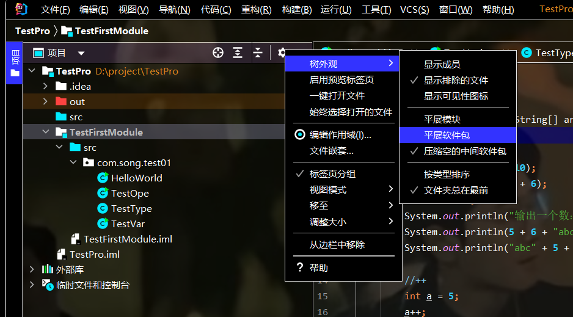
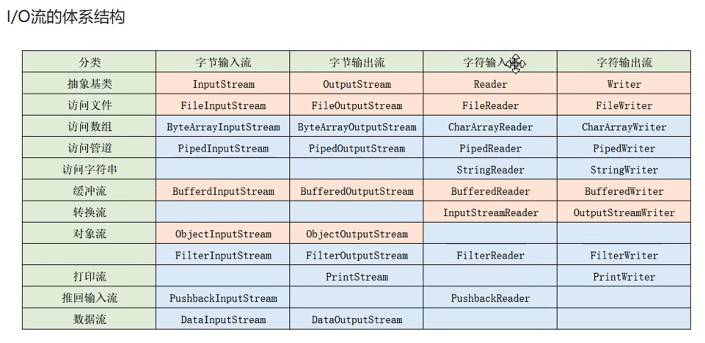
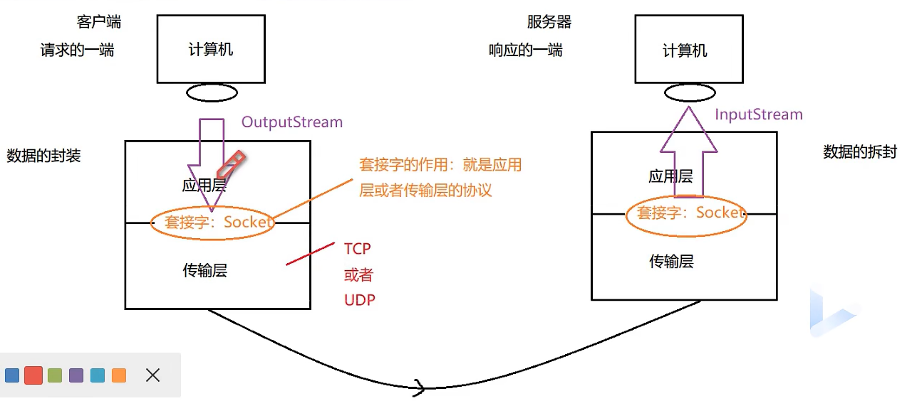
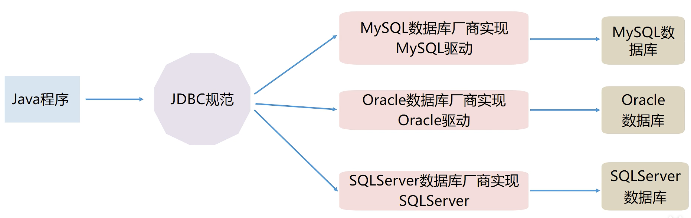

## JDK下载位置
>www.oracle.com/technetwork/java/javase/downloads/index.html

<br>

## JDEA下载位置
>https://www.jetbrains.com/

<br>

<br>

## Mysql下载位置
>https://dev.mysql.com/downloads/windows/installer/

## 快捷键
1. `psvm + 回车`：快速引入main方法
2. `sout + 回车`：快速打印输出语句 
3. `Ctrl + D`：复制当前光标所在行到下一行（IDEA中）
4. `Ctrl + Y`：删除光标所在行（IDEA中）
5. `/* + 回车`：多行注释
6. `/** + 回车` | `Ctrl + Shift + /`：多行注释
7. 一般要注意两点：（1）字体大小；（2）区分大小写
8. Java中变量不可以重复定义
9. 变量本质上就是一个"可操作的存储空间"。空间位置是确定的，但放置什么值不确定。Java是一种强类型语言，每个变量都必须声明其数据类型。
10. 平展数据包：

11. `public static`：方法的修饰符
12. `Ctrl + 鼠标点击方法`：查明方法是在哪编写的
13. `Alt + Insert`：打开构造器
14. `break`：结束当前的循环，可在if语句中使用
15. `Alt + Enter`：自动添加局部变量
16. `Win + E`：调出子电脑

<br>

## 数据类型
Java的数据类型可分为两大类：基本数据类型和引用数据类型。基本数据类型又分为数值型（byte、short、int、long）、字符型（char）、布尔型（boolean）。引用数据类型又分为类（class）、接口（interface）、数组。

<br>

## 流程控制语句
流程控制语句是用来控制程序中各语句执行顺序的语句：顺序、分支、循环。分支结构分为if分支（单分支、双分支、多分支）、switch分支（不常用）。循环结构分为while循环、for循环、do-while循环（不常用）。

<br>

## 形参、实参
形式参数：在方法声明时用于接收外界传入的数据<br>
实际参数：调用方法时实际传给方法的参数

<br>

## 方法的重载
在同一个类中，方法名相同，形参列表不同的多个方法，构成了方法的重载。判断方法是否重载不看方法的修饰符、返回类型。方法重载必须要求方法名相同、形参必须不同（类型不同、顺序不同、个数不同）。

<br>

## 数组
数组是相同类型数据的有序集合，每一个数据称作一个元素，每个元素可以通过一个索引（下标）来访问它们。
```Java
int[] arr = new int[4];
```
遍历数组：
```Java
for(int i = 0; i < 4; i++){
    System.out.println(arr[i]);
}
```
或者：
```Java
for(int num:arr){
    System.out.println(num);
}
```
<br>

数组的缺点：<br>
（1）数组一旦指定了长度，那么长度就确定了，不可以更改；<br>
（2）删除、增加元素效率低，因为当前要插入/删除的位置后面的元素都要依次向前挪动。<br>
（3）**数组中实际元素的数量是没有办法获取的，因为没有提供对应的方法或属性来获取。**<br>
（4）数组存储：有序、可重复，对于某些场景不适用。

<br>

## 类
类名首字母大写，遵循驼峰命名原则。<br>
特性-属性，行为-方法

<br>

## 构造器
对于一个类来说，一般有三种常见的成员：属性（名词）、方法（动词）、构造器。构造方法也叫构造器，是一个类创建对象时被**自动调用**的特殊方法，用于**对象的初始化**。
>Java通过new关键字来调用构造器，从而返回该类的实例
```Java
Person p = new Person();
```
上述：`Person()`是一个空构造方法<br>
new关键字对方法进行调用<br>
构造器作用：底层帮我们创建对象，在创建对象化以后进行初始化操作<br>
如果一个类没有显式编写构造器的话，那么系统会为这个类默认分配一个空构造器。
<br>

构造器的声明方法：没有返回值类型；方法名、构造器名、类名必须一样。

<br>

## 封装
思想：高内聚，低耦合：<br>
高内聚：类的内部数据操作细节自己完成，不允许外部干涉；
低耦合：仅对外暴露少量的方法用于使用。<br>
隐藏对象内部的复杂性，只对外开放简单的接口。

<br>

## 继承
子类 extends 父类<br>
好处：提高代码复用性；便于代码扩展；多态使用的前提。

<br>

## 重写
重写必须有子类跟父类，子类中重写的方法的方法名和形参列表必须和父类中的方法一样。

<br>

## 多态
即同一种行为，不同的子类呈现出来的状态是不同的。多态跟属性无关，多态指的是方法的多态，而不是属性的多态。

<br>

## 异常
对于你预知可能出现错误的代码，放入try中，如果出现了问题，会将异常封装成一个对象，然后用一个值来接收这个对象。如果try中出现异常，则执行catch中的语句，接着执行catch之后的语句；如果发生异常但并没有被捕获到，则catch中的语句不会执行，程序报错，catch后的语句也不会被执行；这时有finally关键字，无论发生异常有没有被捕捉到，均会执行finally中的代码。throw在类中使用人为制造异常，throws在方法声明时使用。

<br>


## 集合
定义一个集合：
```Java
ArrayList list = new ArrayList();
list.add("aaa");    //增加元素
list.add("bbb");
list.add("ccc");
list.add("ddd");
list.remove(0);     //删除元素
list.remove("bbb");
list.set(0, "eee"); //修改元素
list.get(2);
for(int i = 0; i < list.size(); i++){
    System.out.println("list.get(i)");
}
```

<br>

## File类
File类对象可封装要操作的文件，可通过File类的对象对文件进行操作，如查看文件的大小、判断文件是否隐藏、判断文件是否可读等。<br>
但是File类并不涉及文件内容的操作，单靠File类对象无法实现，这时需要借助I/O流完成。


<br>

## 线程
如果进程只有一条执行路径的话，那就是单线程；如果进程中有多条执行路径，则是多线程。
>进程是操作系统进行资源分配的基本单位<br>
>线程是操作系统调度执行的基本单位
<br>

创建线程有三种方式：<br>
（1）继承Thread类；<br>
（2）实现Runnable接口；<br>
（3）实现Callable接口。

<br>



<br>

## XML
文件首部必须加上：
```XML
<?xml version="1.0" encoding="utf-8" ?>
```
有且只有一个根标签

<br>

>框架 = 注解 + 反射 + 设计模式

<br>

## Mysql
优点：Mysql数据库体积小、速度快、成本低、跨平台、开放源码...


<br>

## JDBC

>MySQL数据库厂商对JDBC规范的实现就叫做MySQL驱动
<br>

JDBC(Java DataBase Connectivity-Java数据库连接)，是SUN公司定义的一套接口（规范）
<br>

想要使用JDBC，就要在程序中导入驱动包：
