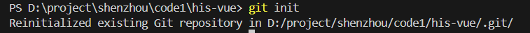
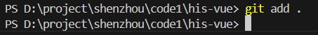
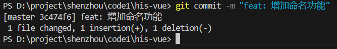

# 3/5
1. 当使用`npm`组件下载`router`、`less`等依赖时，出现警告，检索得知可能是由于`Nodejs`的版本太低，于是将17版本卸了重新下载18版本的，果然依赖下载成功。
2. 在此次毕设中我使用的是`Typescript`，而非`Javascript`。`Typescript`同样是一门语言，有自己的语法和约束等等，可以看作是`Javascript`的超集。比如说在定义变量的时候，定义的什么类型在后续数据输入的时候就必须是该种类型。
3. 在今后的工作中，有一种工具不可避免的会被使用到----`Git`。`Git`是一种系统核心，而非一种软件，可以看作是一种工具，一座连通本地副本和远程仓库的桥梁。
4. 需要知道的：
- 什么是`git`仓库、`github`
- 什么是`git` 
- `git`怎么克隆代码
- `git`怎么提交代码
- `git`怎么创建分支  
   

# 3/6
打开任务视图：`Win+Tab` 
1. `git`初始化仓库：`git init` 
2. 连接远程仓库: `git remote add origin https://git.imooc.com/gastrodia/his-vue.git`
3. 查看文件变更：`git status`
4. 将变更文件添加到暂存区：`git add`  
5. 提交到本地仓库：`git commit -m "feat: 新功能"`  fix: 改bug  
6. 推送到远程仓库：`git push -u origin master`   
后续推送：`git push`
7. 拉取远程仓库变更到本地：`git pull`

`Git`工作原理概述：
自己开发程序上传到远程仓库需经历三步:（1）提交到暂存区；（2）提交到本地仓库；（3）提交到远程仓库。除创建本地仓库指令和连接远程仓库指令在第一次会用到，后面都不会用到。此外当你与另一个人都在编写同一行或多行代码时，他先提交，当你再想要提交就可能发生冲突，这时当你提交时,`git`会提醒你不能提交，有人提交了，你就需要拉取远程仓库的代码，由你决定选取谁的代码。

1. 创建本地仓库：`git init`  

2. 连接到远程仓库：`git remote add origin https://git.imooc.com/gastrodia/his-vue.git` 
3. 编写程序之后提交到暂存区：`git add .`

4. 接着提交到本地仓库：`git commit -m "feat: 增加命名功能"`

5. 最后上传到远程仓库：
（1）第一次提交：`git push -u origin master` 
（2）第二次提交：git  push
6. 进阶版：模拟二人对峙
  对方编辑：
  

   己方提交：
   

3/7
1.localStorage知识点
2.
3.
4.处理bug：
报错如下：

为类型错误问题，在使用Vue Router的’router-view’组件时，给’key’绑定了一个路由查询参数’random’。错误信息是’Type ‘LocationQueryValue | LocationQueryValue[]’ is not assignable to type ‘Property | undefined’,说明’router.currentRoute.value.query.random’的类型可能是’string | null | undefined’或者数组，而’key’属性需要的是’string | number | symbol | undefined’,当’random’为’null’时，就会出现类型不匹配。注释中提到，添加随机数参数是为了避免路由引用页面时浏览器不刷新内容，通常，这种做法是通过改变’key’强制组件重新渲染，而’random’参数应该是每次生成的随机数，以确保’key’唯一，但用户当前字节哦才能够查询参数中获取’random’,这可能有问题，因为如果’random’不存在或者为’null’,就会导致类型错误。可能的解决方案有集中：(1) 确保’random’参数存在且不为null,如果用户能保证每次路由跳转时都带有’rangom’参数，并且其值不为null,那么可以通过类型断言来消除错误，但这种情况在实际应用中不太可能，因为首次加载时可能没有该参数。(2) 处理可能的null或者undefined值，通过默认值或可选链操作符，确保’key;是合法的类型，例如，当’random’不存在时，提供一个默认值或使用当前时间戳作为回退。(3)直接在组件内生成随机数，既然用户的目的是随后数强制刷新，直接在’key’中生成随机数可能更合理，而不是依赖路由参数。这样可以避免依赖外部参数，同时确保每次组件渲染时’key’都不同。
此次bug我使用的是时间戳，直接在key中使用时间戳，完全无需依赖URL参数，直接使用Date.now()生成唯一值：

此外无需导入
5.flex布局
布局的传统解决方案，依赖于display属性、position属性、float属性，但是这种对于特殊布局不方便。于是2009年提出了flex布局，可以简便、完整、响应式地实现各种页面布局。
·任何一个容器都可以指定为flex布局：

水平的时主轴、垂直的时交叉轴。有6个属性设置在容器上：
·flex-direction:决定主轴的方向即项目的排列方式

·flex-wrap:如果一条轴线排不下，如何换行

nowrap:不换行		wrap：换行，第一行在上方   wrap-reverse:换行，第一行在下方
·flex-flow
·justify-content：定义了项目在主轴上的对齐方式
·align-items
·align-content

3/10
1.在前端vue项目中遇到了如下报错：Property 'proxy' does not exist on type 'CreateComponentPublicInstanceWithMixins<ToResolvedProps<{}, {}>, { SvgIcon:代码如下：

检索得知，使用’proxy.isAuth’进行权限验证导致了类型错误，因为Vue3的组件实例类型中默认没有’proxy’属性或者’isAuth’方法。在代码片段中，’proxy.isAuth’在v-if指令中使用，导致类型错误。解决方案的核心时如何让TypeScript识别’proxy’上的’isAuth’方法。获取组件实例并声明实例：
2.报错：Property 'siteContent' does not exist on type 'CreateComponentPublicInstanceWithMixins<ToResolvedProps<{}, {}>, { SvgIcon:这个错误表明在组件的实例类型中找不到siteConotent属性，可能是在模板中使用的siteContent.menuActiveName，但在组件的脚本部分没有正确生命siteContent这个变量或响应式对象。我使用的是<script setup>语法，所以需要检查是否在setup中正确声明了siteContent。解决方法为在组件脚本中添加声明：

Error 'Operation CREATE USER failed for 'sync'@'%'' on query. Default database: ''. Query: 'CREATE USER 'sync'@'%' IDENTIFIED WITH 'mysql_native_password' AS '*DA86F1D047055A5730A2A85F4C6320534406A1E4''
3/13
先来说说这两天遇到的问题吧，昨天跟今天上午遇到了两个难关。第一个是建立数据库主从同步，其中1、4为主节点兼写节点，2、3、5、6均为读节点且2、3节点跟节点1相连，5、6节点与节点4相连。之所以使用主从同步，是提防如果有写节点或者读节点宕机，马上会有节点接替其原本的读写操作。六个节点的容器创建都很顺利，在容器运行前提下，将容器连接到Navicat，从节点连到主节点都成功了，最后4连1成功了，1连4却失败了，等于说是单向同步。于是我怀疑是不是之前创建某个容器的时候敲错了一些指令，于是我删除1、2、3节点，重新创建容器建立连接，结果不仅1连4失败了，4连1也失败了，于是我又将全部节点删除，推倒重建，结果依然不行。我有点担心一直卡在这里，因为这些来回重建已经花费了我三四个小时了。于是我抱着试一试的态度看看先将两个主节点试着连接起来，如果成功了再挂载其他从节点，毕竟主要就是两主节点挂载失败了，如果不成功也花费不了太大的精力跟时间，毕竟创建容器建立连接的步骤我已经弄了三遍了，已经非常熟练了。万万没想到的是，这样做反而连接上了，实现了双向同步，于是激动的心、颤抖的手，我赶忙又将剩下四个节点创建容器并连接，都一一成功，这一刻我是有一丝丝的成就感的，也有一丝解脱，因为卡在一个地方一直过不去真的很难熬。
第二个是在CentOS7上的docker环境导入mycat镜像，我的镜像文件已经准备好了，结果导入失败：
明明之前也导入了一个镜像文件成功了，这次是同样的步骤结果却不行，只是中间创建了很多次的容器而已，于是我又跑去网上检索相关报错的，有差不多一样的报错，也有报错一样的，第一次尝试：
结果创是创出来了，结果文件大小为0，但我准备的镜像文件有400多mb，说明创建失败。
第二次尝试，依旧不成功：

第三次尝试，依旧不成功：

第四次尝试，心态隐约有点崩溃了，我在想如果导入不了镜像文件，怎么将mycat和navicat连接起来：

....

没有办法了，我承认我看不懂哪里出错了，我打算最后再拼一把，我去deepseek上就我面临的问题问了，罗列出一堆原因：

于是我想着最后再坚持一下，将我下载的mysql.tar.gz卸载了又重新下载，执行了一边导入的指令，结果就这么水灵灵的导入成功了，我其实很想问一句：你是不是故意在跟我作对，第一遍的时候你怎么不成功。但是问题解决了心里的石头总算落下来了，这个问题花费了我三四个小时：

3/14
1.一键生成可下载PTG插件。
2.前端Vue：
·<el-card></el-card> :让内容显示在一块白色背景板上。卡片控件。
3.<template>标签：
·<template>与
区别：
- <template>不会直接渲染到DOM中，逻辑容器、动态生成，适用于逻辑和条件渲染。
- 
会直接渲染到DOM，布局、组织结构，适用于视觉展示和样式。
·什么是template标签？
- <template>标签是一个HTML元素，专门为模板内容而设计，与普通的HTML标签不同，<template>标签中的内容不会直接渲染在浏览器中。
·为什么使用template标签？
- 可以用作逻辑层次结构的容器，帮助组织组件的结构。
- 避免在渲染时产生不必要的DOM节点，使在布局和样式管理上会更加干净。
- 动态渲染：在配合Vue指令，如v-if,v-for使用时，可以根据条件或数据动态添加或移除HTML元素。
用中文简要解释
4.代码解析
·if(route.meta.isTab)
- 是前端框架中的路由配置，route是一个路由对象，meta是路由的元信息字段，通常用来存储一些额外的配置，isTab可能是一个自定义的布尔值，用来表示该路由是否对应一个标签页。
·let lab=siteContent.mainTabs.filter(item=>item.name===route.name)[0];
- siteContent.mainTabs应该是一个数组，里面保存了当前打开的标签页信息，使用filter方法过滤出name属性与当前路由名称route.name相同的元素，然后取第一个结果，因为filter返回数组，所以用[0]获取第一个匹配项，如果找不到，结果会是undefined。可能场景在切换标签页时，检查当前路由是否存在与打开的标签页列表中，如果存在就激活他，不存在就添加新标签。
5.Java面向对象编程（OOP）

·Vue中想打出空格：&nbsp;
·Vue中给字体加粗：font-weight=bold;
·Vue中让字与字之间间隔一定距离：letter-spacing: 1px;
·Vue中上外填充：margin-top: 15px;
·Vue中左边框：border-left: solid 5px @bc-24;	//实线 大小 颜色
·Vue中圆角画弧：border-radius：40px；	//半径是40
6.为了让Vue页面切换不同的内容，需要给前端项目引入路由功能。Vue页面整合路由模块：首先创建一个路由配置文件，然后在main.ts文件上创建路由对象，并且将这个路由对象绑定到Vue对象上，最后还要在Vue页面上声明路由标签，正是做的这些配置，框架页面才能够引用不同的Vue页面。
7.本次毕设需要配置数据库连接池，虽然我们用的是MySQL数据集群，但是我们的Java不是去连接某一个数据节点，而是应该去连接MyCat中间件，Java项目将SQL语句发送给Mycat，Mycat将SQL语句路由给某一个MySQL节点去执行。
8.想要使用Jetty服务器，需要配备线程池。Jetty有三个线程池，利用threads来规定一下线程池：
·acceptors线程池用来接收HTTP请求。
·selectors线程池用来处理HTTP数据包。
·worker线程池负责调用Web方法。
- MongoDB自带数据库连接池
- SpringBoot中用RedisTemplate来读写Redis里面的数据

3/16
1.代码解析
代码：public class StpInterfaceImpl implements StpInterface{
用途：这是一个Java类，实现了某个接口StpInterface。
·在Sa-Token中，StpInterface是权限验证的接口，用户需要实现它来提供权限和角色数据。可能是在使用类似的安全框架，需要自定义权限验证逻辑。
·这行代码是Java类声明，表示定义了一个名为StpInterfaceImpl的类，并实现了StpInterface接口。
·public：表示该类是公开的，其他包中的类可以访问。
·class StpInterfaceImpl：定义了一个名为StpInterfaceImpl的类（通常以Impl结尾表示是接口的实现类）
·implements StpInterface:表示该类实现了StpInterface接口，必须重写接口中定义的所有抽象方法。
·假设StpInterface是权限框架（Sa-Token）中定义的用户权限加载接口，该实现类的作用是为当前登录用户提供权限数据。实例：
public class StpInterfaceImpl implements StpInterface{
@Override
public List<String> getPermissionList(Object loginId, String loginType){
//根据用户ID查询数据库或缓存中的权限列表
List<String> permissions=queryPermissionsFromDB(loginId.toString());
return peimissions;
} 

@Override
public List<String> getRoleList(Object logind,String loginType){
//查询用户的角色列表
List<String> roles=queryRolesFromDB(loginId.toString());
return roles;
} 
}
·通过实现接口，强制要求必须实现getPermissionList()和getRoleList()方法，确保权限框架能正确获取用户权限数据。这里注意接口方法必须全部实现，如果未实现接口中的全部方法，编译器会报错。
·在Spring项目中，通常通过@Component注解将该类声明为Bean，让框架自动发现：
@Component
Public class StpInterfaceImpl implements StpInterface{
//方法实现...
}
 
2.代码：
@Resource
private UserDao userDao;
·@Resource是Java的注解，用于依赖注入，用于自动将UserDao类型的Bean实例注入到当前类中。
·依赖注入：
通过@Resource注解，Spring容器会自动将已管理的UserDao实例赋值给userDao字段。
开发者无需手动new UserDao(),实现对象间的解耦。
·注解来源：
@Resource是Java标准注解，Spring框架对其提供了支持。
问：多个同类型Bean如何解决冲突？
答：1.通过@Resource(name=”指定Bean名”)明确指定注入的Bean。
3.使用@Qualifier,注解配合@Autowired。

使用VitePress：
1.去到项目文件夹栏创建 his-note
2.在文件夹路径栏输入 cmd
3.构建一个基本项目：$ npx vitepress init

4.$ npm run docs:dev
5.将VitePress 安装到现有项目中（也可以单独使用）：
*$ npm add -D vitepress 
6.再：$ npm run docs:dev
7.按住Ctrl点击网址：
、
8.开通github账号
9.创建本地仓库：git init
10.连接到远程仓库：git remote add origin https://git.imooc.com/gastrodia/his-vue.git
11. 在项目名his-note下创建.gitignore,其中直接输入不需上传的文件，一个文件一行：

12.上传到暂存区：git add .
13.上传到本地仓库：git commit -m “feat: init”
14.git branch -M main
-M：是用来重命名分支的。如果目标分支存在的话，会强制覆盖。
-M main：将当前分支重命名为main，因为Github现在默认使用main作为默认分支，替代了原来的master。需要将旧的分支改为main，以适应新的命名规范。默认分支是master，现在改名为main。
15.

15.

3/17
1.代码：List<String> list = new ArrayList<>();
·左边是声明一个List类型的变量list，右边实例化了一个ArrayList对象。
·<String>:指定列表中元素的类型为字符串。
·List是一个接口，而ArrayList是它的一个实现类，这里使用了多态，即用接口类型引用具体实现类的对象。这样做的好处是提高代码的灵活性和可维护性，比如以后轻松替换为LinkedList而不需要修改太多代码。List是接口，定义了一些方法，而ArrayList是具体的实现，提供了动态数组的功能。比如，ArrayList支持快速随机访问，而LinkedList则在插入删除时更高效。
·这里的菱形操作符<>在Java 7之后引入，允许在实例化时省略泛型类型，编译器会自动推断类型。泛型即类型安全，避免在运行时出现类型转换错误。List<String>表示这个列表只能包含String类型的对象，如果尝试添加其他类型，编译器会报错，这有助于提前发现错误。
·初始化后的list变量可以调用List接口中定义的方法，比如add，remove，get等，具体实现由ArrayList提供。
·总之，变量声明：List<String> list,使用泛型指定元素类型为String。
接口与实现类的关系：List是借口，ArrayList是实现类。
多态的应用：用接口类型引用具体实现对象。
接口与实现：左侧用List接口类型接收右侧的ArrayList实例。

2.int userId=Integer.parseInt(loginId.toString());
作用：将loginId对象转换为整型用户ID。
拆解：
· loginId.toString():将loginId对象转换为字符串（假设loginId可能是Long、String或其他对象类型，甚至可能是Object）
风险：若loginId为null，会抛出NullPointerException
·Integer.parseInt(...):将字符串解析为int基本类型
风险：若字符串内容非纯数字，会抛出NumberFormatException

