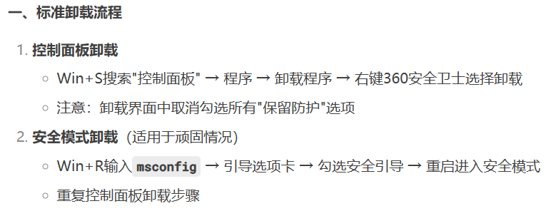
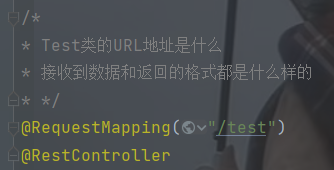
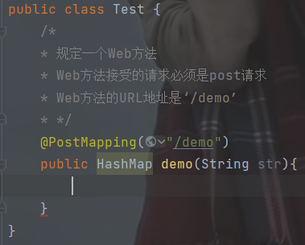

# 每日小Tip
<br>
<br>





<br>
<br>

## 前端允许跨域请求:
```Vue
server:{
    host: "localhost",
    port: 7600,
    cors: true
}
```

<br>
<br>

## 大型网站在负载较大的情况下加载页面也很快是为什么？
这是因为大型的电商网站都会把首页的数据缓存到内存当中，当前端项目渲染首页的时候，后端只需要从内存中提取数据即可，不需要走数据库，所以首页加载速度就明显提升了。

<br>
<br>

## Vue命令行指令：
1. $ `git status`:查看暂存区情况，绿色已上传，红色未上传。

<br>
<br>

## Java标准库
Java标准库是一组预定义的类和接口，为Java程序提供了广泛的功能。这些库位于`java.`和`javax.`包以及一些其他位置，是Java编程语言的核心部分。<br>
**核心Java类库:**
- `java.lang`包:包含所有Java程序都需要的类，如`String`、`Math`、`System`等。这个包由解释程序自动加载，不需要显式说明（不需要用`import`）。
- `java.util`包：包含集合框架（如`List`、`Set`、`Map`），日期和时间API（如`Calendar`、`Date`、`TimeZone`）,随机数生成器（`Random`）等
- `java.io`包：包含用于文件和流操作的类，如`File`、`FileInputStream`、`BufferedReader`、`BufferedWriter`,这些类提供了对不同输入和输出设备读写数据的支持。
- `java.nio`包：提供非阻塞I/O类库，用于提高I/O操作的性能和可扩展性。
- `java.net`包：包含用于网络编程的类，如`URL`、`Socket`、`Serversocket`、`InetAddress`等。
- `java.sql`包：提供与数据库交互的接口，如`Connection`、`Statement`、`ResultSet`等。<br>
其他常用包：
- `java.awt`、`javax.swing`:用于创建图形用户界面（GUI）的类库。
- `java.security`:包含用于加密、访问控制、证书、密钥生成和管理的类。
- `java.util.concurrent`:包含用于并发编程的类，如`Thread`、`Runnable`、`ExecutorService`、`ConutDownLatch`等。

<br>
<br>

## Java API文档
是一个详细的在线资源，其中包含了关于Java标准库中每个类和接口的详细信息，包括其方法和属性描述、示例代码和常见问题解答，可以通过`Oracle`官方网站来访问这些文档。

<br>
<br>

## Java类
### @1
 `RoutimeException`:是Java标准库中的一个类，继承自`Exception`,是所有运行时异常的基类。<br>

未检查异常：与`IOException`等已检查异常不同，`RoutimeException`不需要在方法签名中声明，也不强制要求使用`try-catch`块进行捕获。<br>
典型错误类型:`RoutimeException`通常用于描述程序逻辑上的错误，编译器无法检查这些错误，通常是程序员的疏忽或输入不当导致的。

<br>
<br>

## 全局处理异常
`SpringBoot`提供了全局处理异常的技术，只要我们给某个Java类用上`@RestControllerAdvice`注解，这个类就能捕获SpringBoot项目中所有的异常，然后统一处理，即把异常的详情信息输出到后端的日志里面，然后将精简的异常信息返回给前端项目。

<br>
<br>

## 异步线程
SpringBoot会把某些任务对象推给线程池去执行。之所以叫异步线程，是因为线程池中的线程相当于主线程来说就是异步的：主线程把任务推给线程池，线程池挑选某个空闲线程去执行这个任务，主线程并不会等待线程池的执行结果，主线程会继续往下做别的事情。

<br>
<br>

## 注解
1. `@EnableAsync`:主类加上此注解后，SpringBoot就开启了异步线程的功能。这样某些任务就可以推送给线程池去执行。
<br>

2. `@Async`:向线程池推送任务去执行。<br>
定义了一个Java类，名字叫什么无所谓：
```Java
public class CheckupWorkAsync{

    //声明一个方法,推给线程池去执行
    //注解括号里的是线程池执行者的名字
    @Async("AsyncTaskExecutor")
    public void createReport(Integer id){
        
    }
}
```