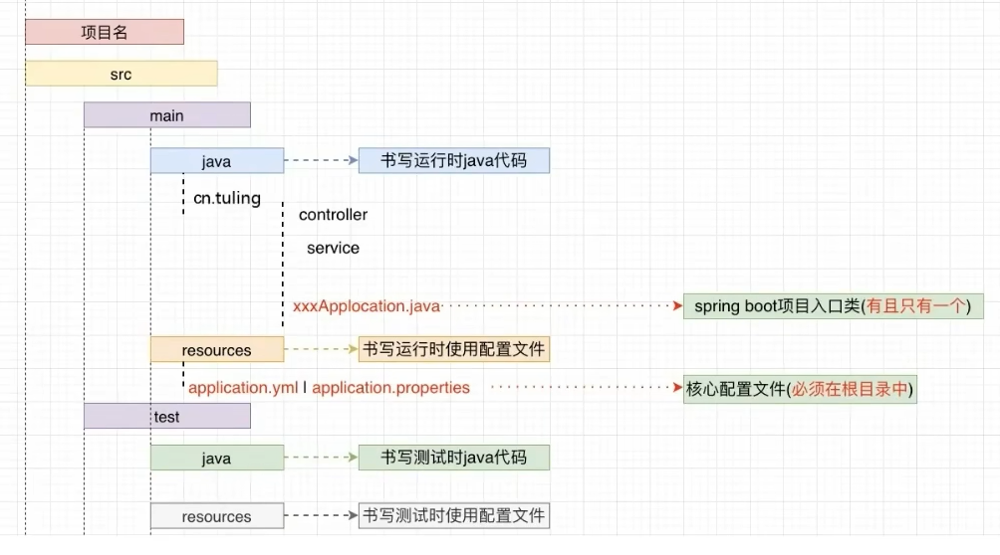

# 每日小Tip
<br>
<br>


<br>
<br>

## 前端允许跨域请求:
```Vue
server:{
    host: "localhost",
    port: 7600,
    cors: true
}
```

<br>
<br>

## 大型网站在负载较大的情况下加载页面也很快是为什么？
这是因为大型的电商网站都会把首页的数据缓存到内存当中，当前端项目渲染首页的时候，后端只需要从内存中提取数据即可，不需要走数据库，所以首页加载速度就明显提升了。

<br>
<br>

## Vue命令行指令：
1. $ `git status`:查看暂存区情况，绿色已上传，红色未上传。

<br>
<br>

## Java标准库
Java标准库是一组预定义的类和接口，为Java程序提供了广泛的功能。这些库位于`java.`和`javax.`包以及一些其他位置，是Java编程语言的核心部分。<br>
**核心Java类库:**
- `java.lang`包:包含所有Java程序都需要的类，如`String`、`Math`、`System`等。这个包由解释程序自动加载，不需要显式说明（不需要用`import`）。
- `java.util`包：包含集合框架（如`List`、`Set`、`Map`），日期和时间API（如`Calendar`、`Date`、`TimeZone`）,随机数生成器（`Random`）等
- `java.io`包：包含用于文件和流操作的类，如`File`、`FileInputStream`、`BufferedReader`、`BufferedWriter`,这些类提供了对不同输入和输出设备读写数据的支持。
- `java.nio`包：提供非阻塞I/O类库，用于提高I/O操作的性能和可扩展性。
- `java.net`包：包含用于网络编程的类，如`URL`、`Socket`、`Serversocket`、`InetAddress`等。
- `java.sql`包：提供与数据库交互的接口，如`Connection`、`Statement`、`ResultSet`等。<br>
其他常用包：
- `java.awt`、`javax.swing`:用于创建图形用户界面（GUI）的类库。
- `java.security`:包含用于加密、访问控制、证书、密钥生成和管理的类。
- `java.util.concurrent`:包含用于并发编程的类，如`Thread`、`Runnable`、`ExecutorService`、`ConutDownLatch`等。

<br>
<br>

## Java API文档
是一个详细的在线资源，其中包含了关于Java标准库中每个类和接口的详细信息，包括其方法和属性描述、示例代码和常见问题解答，可以通过`Oracle`官方网站来访问这些文档。

<br>
<br>

## Java类
### @1
 `RoutimeException`:是Java标准库中的一个类，继承自`Exception`,是所有运行时异常的基类。<br>

未检查异常：与`IOException`等已检查异常不同，`RoutimeException`不需要在方法签名中声明，也不强制要求使用`try-catch`块进行捕获。<br>
典型错误类型:`RoutimeException`通常用于描述程序逻辑上的错误，编译器无法检查这些错误，通常是程序员的疏忽或输入不当导致的。

<br>
<br>

## 全局处理异常
`SpringBoot`提供了全局处理异常的技术，只要我们给某个Java类用上`@RestControllerAdvice`注解，这个类就能捕获SpringBoot项目中所有的异常，然后统一处理，即把异常的详情信息输出到后端的日志里面，然后将精简的异常信息返回给前端项目。

<br>
<br>

## 异步线程
SpringBoot会把某些任务对象推给线程池去执行。之所以叫异步线程，是因为线程池中的线程相当于主线程来说就是异步的：主线程把任务推给线程池，线程池挑选某个空闲线程去执行这个任务，主线程并不会等待线程池的执行结果，主线程会继续往下做别的事情。

<br>
<br>

## 注解
1. `@EnableAsync`:主类加上此注解后，SpringBoot就开启了异步线程的功能。这样某些任务就可以推送给线程池去执行。
<br>

2. `@Async`:向线程池推送任务去执行。<br>
定义了一个Java类，名字叫什么无所谓：
```Java
public class CheckupWorkAsync{

    //声明一个方法,推给线程池去执行
    //注解括号里的是线程池执行者的名字
    @Async("AsyncTaskExecutor")
    public void createReport(Integer id){
        
    }
}
```
<br>

3. `@Data`：生成get、set方法。
<br>

4. `@NotBlank`:验证变量的值是否为空值或者空字符串。(针对字符串)
```Java
@NotBlank(message = "username不能为空")
private String username; 
```
<br>

5. `@NotNull`：用于标记某个字段、方法参数或返回值不允许为`null`。其核心目的是在编译时或运行时检查空值，避免潜在的`NullPointerException`。
```Java
@NotNull
public Integer length;
```
<br>

6. `@RestController`:接口方法返回对象，转换为json文本。在接口类里面使用，因为如果把当前的接口返回给对应的客户端，肯定需要把后端的数据转化为json文本，对应的客户端才能够更好的进行处理。

<br>

7. `@RequestMapping("/user")`:加一级类级别的映射,到时候客户端去访问当前的接口的时候，即`localhost:8088/user/**`来访问后面的接口。

<br>

8. `@Repository`:将当前类注册为spring的bean；来表示数据访问层的bean。<br>
`@Service`:将当前类注册为spring的bean；来表示业务逻辑类的bean。<br>
`@Component`:将当前类注册为spring的bean。<br>
这样分开来做职责更加明确。

<br>

9. `@Pattern`:主要作用是对字符串字段进行正则表达式匹配，确保输入的数据符合指定的格式。注意跟其他验证注解的区别，比如`@Size`是限制长度，`@Email`是专门验证邮箱，而`@Pattern`更加灵活，可以用正则表达式自定义规则，另外，`@Pattern`的message属性，用于自定义错误信息。
```Java
@Pattern(regexp="^[a-zA-Z0-9]{6,20}$", message="password内容不正确")
```

<br>

10. `@Min`：是`Java Bean Validation`中的一个注解，用于验证数值的最小值，它通常用在字段、方法参数或返回值上，确保数值不低于指定的最小值。

<br>

11. `@Range`:是`Hibernate Validator`提供的一个扩展注解，用于验证数值是否在指定范围内。

<br>

12. `@SaCheckPermission`:是`Sa-Token`权限认证框架提供的注解，用于在方法或接口级别进行权限验证，当用户访问被注解标记的资源时，系统会自动检查该用户是否具备指定权限，若无权限则拦截请求并抛出异常。<br>
基础使用：添加依赖：在`pom.xml`中引入`Sa-Token`：
```xml
<dependency>
    <groupId>cn.dev33</groupId>
    <artifactId>sa-token-spring-boot-starter</artifactId>
    <version>1.37.0</version>
</dependency>
```
在方法上添加注解：
```java
@RestController
public class UserController{
    //检查单个权限
    @SaCheckPermission("user:add")
    @PostMapping("/user/add")    //进行映射  
    public String addUser(){
        return "创建用户成功";
    }

    //检查多个权限（AND逻辑）
    @SaCheckPermmission({"user:delete","user:admin"})
    @DeleteMapping("/user/{id}")    //使用delete请求方法
    public String deleteUser(){
        return "删除用户成功"；
    }

    //检查多个权限（OR逻辑）
    @SaCheckPermission({"user:update","user:admin"},mode=SaMode.OR)
    @PutMapping("/user/{id}")   //使用PUT请求方法，修改
    public String updateUser(){
        return "更新用户成功"；
    }
}
```
<br>

如何实现免鉴权接口？<br>
使用`@SaCheckDisable`或配置白名单：
```java
@SaCheckDisable
@GetMapping("/public/data")
public String publicData(){
    return "开放数据"；
}
```
<br>

如何区分角色和权限？<br>
角色：使用：
```java
@SaCheckRole("admin")
```
权限：使用：
```java
@SaCheckPermission("user:delete")
```
又或者：
```java
@SaCheckPermission(value="ROOT","USER:SELECT",mode=SaMode.OR)
```

<br>

13. `@RequestBody`:是用来将HTTP请求体中的JSON或XML数据绑定到Java对象的。通常用于POST或PUT请求，处理前端发送的复杂结构数据。这个注解是Spring框架中用于将HTTP请求体内容绑定到Java对象的注解，主要用于处理JSON/XML格式的请求数据。<br>
应用场景：接收前端通过POST、PUT等请求发送的复杂结构化数据，如对象、集合嵌套。
<br>

对比其他注解：<br>
`@RequestParam`:接收URL参数或表单数据。
`@PathVariable`:接收URL路径中的动态参数。
`@RequestBody`:接收请求体中的结构化数据(如application/json)。

<br>

14. `@Valid`:此注解可能是在开发`RESTful API`时，遇到了需要客户端传入的数据的情况，比如表单提交或JSON请求体。`@Valid`通常与`@RequestBody`一起使用，用于触发`Bean Validation`,比如`Hibernate Validator`。
<br>

`@Valid`是`Java Bean Validation`规范中的注解，用于触发对对象属性的自动验证。在Spring中，它常与`@RequestBody`、`@ModelAttribute`等注解配合使用，确保客户端传入的数据符合业务规则（如非空、长度限制、格式校验等）。
<br>

核心功能：（1）自动校验请求数据：对客户端传入的JSON、表单等数据进行字段级验证，确保合法性：
```java
@PostMapping("/users")    //进行映射，使用的POST请求方法
public ResponseEntity<User> createUser(@Valid @RequsetBody User user){
    //若user的字段不符合校验规则，直接抛出异常
    return ResponseEntity.ok(userService.save(user));
}
```
<br>

(2)支持级联验证：如果对象的属性是另一个对象，可通过嵌套`@Valid`触发级联校验：
```java
public class Order{
    @Valid  //触发Address内部的校验规则
    private Address address;
}
```
<br>

(3)与校验注解配合使用：需在字段上定义具体的校验规则：
`@NotNull`:字段不能为null<br>
`@Size`:字符串/集合长度范围<br>
`@Email`:邮箱格式校验<br>
`@Min/@Max`:数字最小值/最大值<br>
`@Pattern`:正则表达式匹配<br>

<br>
<br>

## 构建
1. 在Java文件夹下的`com.example.his.api`包下创建`mis`包，在`mis`包下新建一个包叫`service`,在`service`包下新建一个接口叫`UserService`,在接口里面声明抽象方法。接下来去到实现类里面把抽象方法实现一下，在package`service`底下新建一个包叫`Impl`，在这个包里面新建一个Java类叫`UserServiceImpl`。并且再`mis`包下边新建一个包叫`controller`,如果写Web方法就放在`controller`的实现类里面。


<br>
<br>

## 引用变量
在Java中，引用变量是指向对象的变量，它们存储的是对象在内存中的地址，而不是对象本身的值。引用变量的主要特点是通过它们可以访问对象，并且可以通过赋值操作将一个引用变量的值赋给另一个引用变量。引用变量包含了对对象的引用，假如定义一个类`Circle`，这个类是一种引用类型，该类类型的变量可以引用该类的一个实例：
```Java
Circle circle = new Circle(9);  //参数表示半径
```
这个例子中，变量`circle`的值保存的是一个引用，它指明这个`Circle`对象的内容存储在内存的什么位置。
<br>

**基本类型变量和引用类型变量的区别：**<br>
每个变量都代表一个保存了存储值的内存位置，声明一个变量时，就是在告诉编辑器这个变量可以存放什么类型的值。<br>
基本类型变量：在内存中存储的是一个基本类型值，可以在栈中直接分配内存，例如`int a = 1;`中变量a的值就是int值1。<br>
引用类型变量： 对应内存所存储的值是一个引用，是对象的存储地址，对象的引用在栈中，对象实际存放在堆中。

<br>
<br>

## 名词
1. `Dao`：通常指的是数据访问对象（Data Access Object）。

<br>
<br>

## 接口
接口是一种定义方法签名的类型，类可以实现接口来提供具体的方法实现。在Java、ts中，接口是一种约定规范，用于定义类或对象的行为，但不包含具体实现。<br>
核心作用：<br>
1. 解耦：分离“做什么”（接口定义）和“怎么做”（具体实现）。
2. 多态：允许不同类通过同一接口提供不同实现。
3. 标准化：强制实现类遵守统一的方法签名。
```Java
//定义接口
interface Animal{
    void eat(); //抽象方法（无具体实现）
    void sleep();
}

//类实现接口
class Dog implements Animal{
    public void eat(){
        System.out.println("狗吃骨头");
    }
    public void sleep(){
        System.out.println("狗趴着睡");
    }
}
```

<br>
<br>

## SpringBoot
`SpringBoot`是一个脚手架，用于快速搭建一个基于`Spring`的`Web`应用，创建即可开发业务代码。其设计目的是用来简化`Spring`应用的初始搭建以及开发过程。
<br>

**优点：**<br>
（1）快速构建一个独立的`Spring`应用程序；<br>
（2）嵌入了`Tomcat`、`Jetty`，无需部署`WAR`包，只需要将`SpringBoo`t打成一个`Jar`包，直接通过`Java`跟`Jar`就可以直接启动`Web`应用；<br>
（3）提供了各种各样的`starter`，比如说要继承`springvc`，就有`springvc`对应的`starter`；如果要集成`redis`，就用`redis`对应的`starter`，这样就可以简化Maven配置，并且还帮助管理版本号，减少版本不一致带来的版本冲突的问题；<br>
（4）对`Spring`和第三方库提供默认配置，也称为自动配置类，采用约定大于配置的方式，只要添加了对应的`starter`依赖，就会包含对应的自动配置，从而做到开箱即用。<br>
（5）无需配置XML。
<br>

比如对一个用户系统的用户模块，后端通过三层的结构:<br>
第一层是控制层，通过springmvc来实现，：`@RestController`、`@Controller`。<br>
业务层写一些业务逻辑代码,:`@Service`。<br>
数据访问层去提供数据库操作的功能，通过SpringData JPA来实现，是Spring生态自带的，可以无缝的进行集成。
<br>




<br>

想要一个实体类映射为数据库中的一个表，因为springdata jpa是面向对象的方式操作数据库，所以可以加上一个`@Table`，再加上一个`@Entity`,这样就相当于把这个类映射成了一个表。`@Table`默认会将类名当作表名，所以需要在注解中声明一下：<br>
<br>
报错说要添加主键id，解决方法：加上@Id注解，将user_id作为主键id。id是以什么样的方式生成，如果希望它是自动生成的方式，加上`@GeneratedValue`,并指定其策略，比如说**自增**的方式：
<br>
通过可以把字段名用`@Column`改一下，默认情况下会把属性名作为数据库表的字段名，所以可以映射一下：<br>
<br>
如果想项目运行的时候自动生成数据库的表，就需要在`application.properties`配置文件中加上
```Java
spring.jpa.hibernate.ddl-auto=update
```
此外它到时候会生成数据库的SQL语句，希望让他打印在控制台上，可是如果不格式化一下，即`format_sql`一下，它会打印在一行上，不方便我们阅读：
```Java
spring.jpa.properties.hibernate.format_sql=true
```
此外：显示sql：
```Java
spring.jpa.show-sql=true
```
利用这种springdata jpa面向对象的数据库持久化方式可以增加开发效率。


<br>

1. 创建一个空的对象：
```Java
ArrayList<HashMap> list=new ArrayList<>();
```
因为可能在项目的时候，返回json数据给前端项目的时候，`spingboot`有一个特点：返回的json里面如果存在空值的话，`springboot`会自动把这个json属性给去掉，如果不希望前端拿到的json属性缺少属性，宁可让json的属性值是空字符串或者空的数组，也比空值强。如果这个json的属性值是空值，那么`springboot`返回的这个json里面就缺少这个属性。

<br>
<br>

## 问题
### @1
错误：Java：错误：不支持发行版本19
解答：通常是由于项目配置的Java版本与本地安装的JDK版本不一致导致的。
<br>

### @2
错误：`Connection refused:no further information`<br>
解释：这说明客户端无法连接到指定的端口。<br>
诱因：包括服务未启动、端口被占用、防火墙阻止连接，或者SSL证书问题。若使用的是HTTPS，可能还涉及证书信任的问题。<br>
具体分析:（1）服务未运行：检查用户是否启动了后端服务。如果服务没有运行，端口7700自然不会被监听，导致连接被拒绝。<br>
（2）端口监听问题：服务可能运行在错误的端口上，或者服务配置有问题。需要检查应用的配置文件，比如`Spring Boot`的`application.properties`中的`server.port`设置。<br>
（3）防火墙或安全软件拦截：虽然本地连接一般不会被防火墙拦截，但某些安全软件可能会阻止本地回环地址的连接。需要用户检查防火墙设置，暂时关闭防火墙测试。<br>
（4）HTTPS配置问题：使用的是HTTPS，但可能服务没有正确配置SSL证书，或者客户端不信任自签名证书。需要检查服务是否支持HTTPS，证书是否有效，或者建议用户暂时使用HTTP进行测试，排除证书问题。<br>
（5）IPv4/IPv6冲突：本地可能有IPv6的配置问题，导致无法正确解析localhost。可以尝试使用127.0.0.1代替localhost，或者检查hosts文件配置。

<br>
<br>

## Rest
其实就是客户端根据不同的请求方法：`GET`、`POST`、`PUT`、`DELETE`。当我们发起任何一个请求，比如打开任意一个网页，到我们服务端都会带一个请求头，这个请求头就会有它当前的请求方法。`GET`表查询，用`@GetMapping`。`POST`表新增，用`@PostMapping`来进行映射。`PUT`表修改，用`@PutMapping`。`DELETE`表删除，用`@DeleteMapping`。<br>
例如增加：
```Java
@PostMapping
public String add(){

}
```
这里`add()`需要接受一个客户端传过来的`user`信息,当然还可以直接把这个`User`类用于参数接收，即：
```Java
@PostMapping
public String add(User user){

}
```
但对于规范有要求的项目，一般都会用`DTO`的类即数据传输类来去接收这些客户端请求过来的参数。因为客户端请求过来的参数不一定就是pojo类所包含的这几个参数：

我的这个pojo类只有四个参数，用User类来接收完全可以。对于有规范要求的项目，可以在`pojo`里面再加一个`dto`的包，创建一个`UserDto`类。然后将`User`类里面的声明变量复制一份到`UserDto`中，于是将`UserDto`作为前端参数的一个接收。<br>
最好加上一个`@RequestBody`,传进`UserDto`来的是一个json文本，会帮我们转换成对象：
```Java
@PostMapping
public String add(@RequestBody UserDto user){

}
```
通常一个业务逻辑类会创建一个接口，这样面向接口进行编程，对于以后的扩展性、维护性会更强。学了设计模式就会明白接口对于扩展性的好处。<br>
在业务逻辑类中标记成spring的bean之后，就可以在接口包中用`@Autowired`自动装配进来，用userService来进行接收。
```Java
@Autowired
IUserService userService;
```
在业务逻辑层调用数据访问的方法，则在数据库访问层`repository`新建一个类。如果我们使用的是springdata jpa，因为对应的增删查改的方法不需要我们自己去实现，我们只需要去继承一个`CrudRepository`，这个接口会自动帮我们实现好。<br>
```Java
public interface UserRepository extends CrudRepository{

}
```
这时可以去指定两个类型：第一个类型是要操作哪个`pojo`类：`pojo`包的`User`pojo类,第二个类型是你当前这个`User`类的主键Id是什么数据类型：`Integer`：
```Java
@Repository //当前类注册为spring的Bean
public interface UserRepository extends CrudRepository(User, Integer){

}
```

<br>
<br>

## 语句解读

### @1
```sql
WHERE id=#{userId}
```
`#{}`同场出现在``MyBatis`这样的持久层框架中，用于参数占位符，用来动态替换为具体的值。这种写法在预编译SQL中的好处，比如参数化查询、提高安全性、以及数据库的查询性能优化。例如，使用`#{}`时，`MyBatis`会将参数作为预编译的参数传递，而不是直接拼接到SQL语句中，从而避免SQL注入攻击。<br>
若`userId=100`，实际执行的SQL会变为：
```sql
WHERE id=?
```

<br>
<br>

## java

### @1
写后端java代码的套路：先写持久层，然后是业务层和web层的代码。<br>
持久层：通常指的是数据访问层，负责与数据库交互，比如使用JDBC、Hibernate或MyBatis。<br>
业务层：也称为服务层，处理业务逻辑，确保业务流程正确执行。<br>
Web层：或表现层，处理用户的HTTP请求和响应，比如Spring MVC中的控制器。<br>
每一层的作用：<br>
持久层负责数据的CRUD操作；业务层处理具体的业务规则和逻辑;Web层负责接收用户输入，调用业务业务层处理，并返回结果给用户。书写顺序方面，通常是从底层到高层，先写持久层，然后是业务层，最后是Web层。
<br>

如果混淆业务层和Web层的职责，或者在分层时不够清晰，导致代码耦合。应该强调各层的独立性和它们如何通过接口交互，以提高代码的可维护性和可测试性。
<br>

**书写顺序一般需要先定义实体类，然后写DAO接口和实现，接着是服务层接口和实现，最后是控制器。**
<br>


<br>
<br>

## DAO接口
DAO的全称是`Data Access Object`,数据访问对象。dao接口即定义数据访问操作的方法，而不涉及具体实现。从分层架构的角度解释，比如MVC模式中，DAO属于数据访问层，负责与数据库交互。接口的作用是为了**解耦**，让业务逻辑层不直接依赖具体的数据库操作实现，方便替换和测试。
<br>

比如一个`UserDAO`接口，里面有save、findById等方法，然后有不同的实现类，比如说用JDBC、Hibernate或者JPA实现的。这样当更换持久层技术时，业务代码不需要改动，只需要换实现类。
<br>

DAO接口是软件设计中数据访问对象模式的核心组成部分，主要用于解耦业务逻辑与数据访问逻辑。DAO接口是一个定义数据操作方法的约定（方法签名），它声明了对某个实体（如数据库表）进行增删改查**CRUD**等操作的标准方法，但不提供具体实现：
```java
public interface UserDao{
    User findById(Long id); //根据ID查询用户
    void save(User user);   //保存用户
    void update(User user); //更新用户
    void deleteById(Long id);   //根据id删除用户
    List<User> findAll();   //查询所有用户
}
```
<br>

DAO接口的实现:<br>
接口定义规范后，需提供具体实现类：<br>
（1）基于JDSC的实现
```java
public class UserDaoJdbcImpl implements UserDao{
    @Override
    public User findById(Long id){
        //使用JDBC编写SQL查询逻辑
        String sql="SELECT * FROM users WHERE id=?";
        //执行查询并返回User对象
    }
}   
```
<br>

（2）基于MyBatis的实现
```java
public interface UserDao{
    @Select("SELECT * FROM users WHERE id = #{id}")
    User findById(Long id);
}
```
<br>

（3）基于Spring Data JPA的实现
```java
public interface UserRepository extends JpaRepository<User,Long>{
    //继承JpaRepository后，自动拥有findId、save等方法
}
```
<br>

DAO和Repository模式的区别:<br>
DAO:设计目标（封装数据访问细节（SQL、事务））、抽象层次（较低层：直接操作表）、典型应用（JDBC、MyBatis）。<br>
Repository:设计目标（提供面向对象的集合式数据操作接口）、抽象层次（较高层：领域驱动设计，DDD）、典型应用（Spring Data JPA、Hibernate）。

<br>
<br>

## Spring MVC
>首先，MVC是一个设计模式。<br>

MVC(Model-View-Controller),用于将应用程序的逻辑分层，让代码更清晰、更易维护。它把程序分为三个核心部分：<br>
（1）`Model`:管理数据和业务逻辑（如数据库操作、计算规则）；<br>
类比现实例子：餐厅的厨房：处理食材、制作菜品。<br>
（2）`View`:展示数据（如网页界面、APP页面）；<br>
类比现实例子：餐厅的菜单和餐桌：展示菜品。<br>
（3）`Controller`:接收用户输入（如点击按钮），协调Model和View更新；<br>
类比现实例子：服务员：接收点餐，通知厨房，上菜。
<br>

工作流程:（1）用户通过View界面触发操作（例如点击按钮）；<br>
（2）Controller接收用户请求，调用Model处理数据；<br>
（3）Model更新数据后，通知View刷新界面。

>`Spring MVC`是Java中的一个框架。<br>

`Spring MVC`是`Spring`框架中的一个模块，专门用于简化`Java Web`开发。它基于MVC模式，提供了现成的组件来处理HTTP请求、数据绑定和视图渲染。<br>
`Spring MVC`的核心组件：<br>
（1）`DispatcherServlet`:前端控制器，统一接收所有请求并分发。
（2）`Controller`:处理业务逻辑，返回数据或视图名称。
（3）`ViewResolver`:根据视图名称找到具体的页面（如JSP、HTML）。
（4）`Model`:封装数据，传递给视图层显示。
<br>

`Spring MVC`处理请求的流程：<br>
（1）用户发送HTTP请求到`DispatcherServlet`。<br>
（2）`DispatcherServlet`调用`HandleMapping`,找到对应的`Controller`。<br>
（3）`Controller`处理请求，返回`Model`和视图名称。<br>
（4）`ViewResolver`解析视图名称，找到具体的页面。<br>
（5）`View`渲染数据（如填充HTML模板），返回响应给用户。
<br>

实例版：
```java
@Controller
public class UserController{
    @GetMapping("/user")
    public String getUser(Model model){
        User user = userService.findUser(); //Model处理数据
        model.addAttribute("user", user);   //数据传递给View
        return "user-page"; //返回视图名称（如user-page.jsp）
    }
}
```
<br>

为什么需要`MVC`和`SpringMVC`？
（1）代码分层清晰：业务逻辑、界面展示、用户输入分离、便于维护。
（2）复用性高：Model可以复用与不同界面（如网页和手机APP）。
（3）简化开发：`Spring MVC`封装了复杂操作（如请求解析、视图渲染），开发者只需关注业务逻辑。

<br>
<br>

## 解耦
>旨在降低组件之间的依赖关系，使各部分能够独立开发、测试、修改和扩展，从而提高系统的灵活性和可维护性。

在软件设计中，模块之间的耦合度高的话，修改一个模块可能会影响到其他模块，这样维护起来就会很麻烦。比如面向对象编程，模块之间不直接依赖具体的实现，而是通过接口来通信，这样即使实现变了，接口不变的话其他模块也不需要改。又比如在分布式系统中，服务之间的解耦可能用消息队列，这样服务之间不直接调用，而是通过消息传递，这样即使一个服务暂时不可用，也不会直接影响其他服务。
<br>

不过，解耦也有代价，比如引入中间件可能会增加系统的复杂性，或者增加延迟。比如用消息队列的话，消息的处理可能会有延迟，而且需要处理消息丢失或者重复的情况。所以在设计的时候需要权衡解耦带来的好处和引入的复杂性。
<br>

另外，设计模式中的观察者模式、发布-订阅模式也可以看作解耦的一种方式。让发布者和订阅者不直接依赖彼此，而是通过事件或者消息来通信。这样发布者不需要知道谁订阅了消息，订阅者也不需要知道消息来自哪里，双方都更独立。
<br>

再比如，解耦的另一个方面可能是分层架构，比如MVC模式，把模型、视图、控制器分开，各自负责不同的职责，这样修改视图不会影响到模型，或者修改控制器也不会直接影响视图。