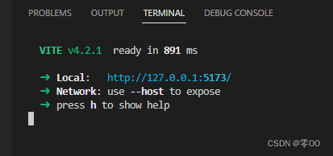

## 查看主机ip地址
1. `Win + X`，点击设置；<br>
2. 点击'网络和Internet'，点击属性；
3. 有本机ip地址。

<br>
<br>

## Vue配置内网ip访问
如果没有进行配置，运行项目之后，看到的访问地址是本地访问地址，其他人访问不了：<br>

如果想要其他人也可以访问，需要设置内网 ip 访问地址，设置方法如下：<br>
在项目根目录下的 “ vite.config.ts ” 文件 中，添加 serve 配置 “host: ‘0.0.0.0’ ”，即添加以下代码：
```Vue
server: {
  host: '0.0.0.0'
},
```
